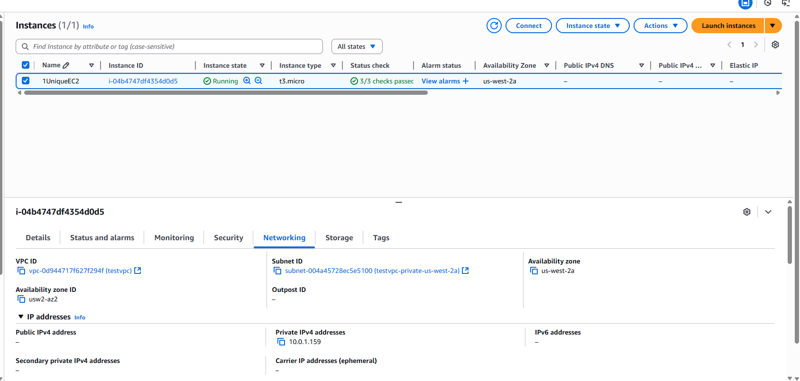
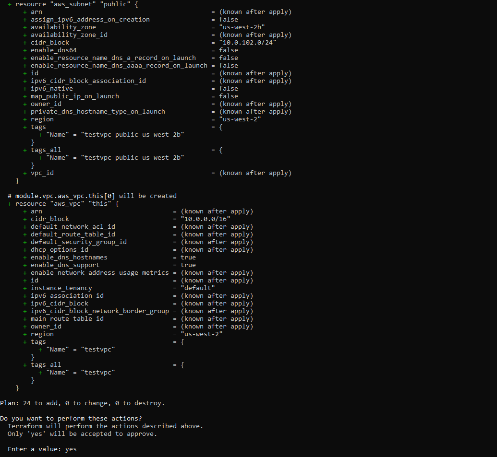
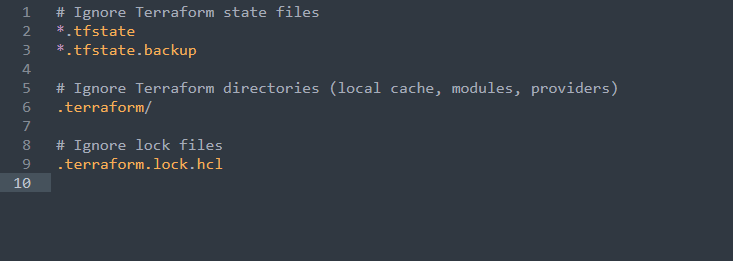

# AWS VPC and EC2 Terraform Project

## Overview

This project is a simple Terraform setup to provision an AWS Virtual Private Cloud (VPC) along with an EC2 instance inside it. It leverages `terraform-aws-modules/vpc/aws` module to create a customizable VPC with public and private subnets across multiple availability zones.

The goal is to automate infrastructure deployment, so instead of manually configuring everything through the AWS Console, you can manage your infrastructure as code.

---

## What This Project Does

- Creates a VPC with a user-defined CIDR block  
- Sets up multiple public and private subnets across 3 availability zones  
- Enables DNS hostnames and optional NAT and VPN gateways  
- Launches an EC2 instance inside one of the private subnets
- Uses variable for AMI ID, instance type, region, and tags  
- Organizes infrastructure using variables for easy customization  


---

## Getting Started

1. **Clone the repository**

```bash
git clone https://github.com/Opeyemi-00/learn-terraform-get-started-aws.git
cd terraform-EC2-with-module-variable-output/Files

```
2. **Customize variables**

If needed, update the variable values in the `variables.tf` or in the `main.tf` to suit your AWS environment and preferences (such as AMI ID, region, subnet CIDRs, instance type).

3. **Initialize and deploy locally**

Run the following commands:
```bash
terraform init
terraform plan
terraform apply
```



4. **Use CI/CD with GitHub Actions**

Alternatively, you can push your changes to GitHub and let the GitHub Actions workflow handle the Terraform deployment automatically. Just ensure the workflow file is in the `.github/workflows` directory at the root of your repository.

⚠️ Important Tips

- Do not commit `.terraform/` or `*.tfstate` files — use a .gitignore to exclude them.
- Default AWS region is set to `us-west-2` — change it using variables if needed.
- If CI/CD is enabled, Terraform will run on each push — no need for local apply unless testing.

📚 What I Learned

- How to structure Terraform projects using modules and variables
- Managing AWS infrastructure with Terraform code rather than manual steps
- Setting up a basic CI/CD pipeline with GitHub Actions for Terraform
- Best practices for handling `.gitignore` and state files

- 


