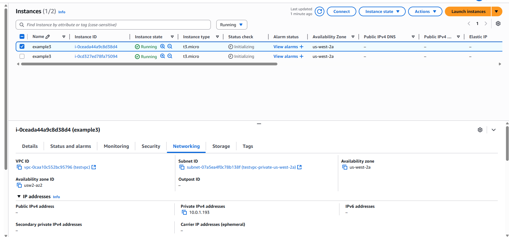
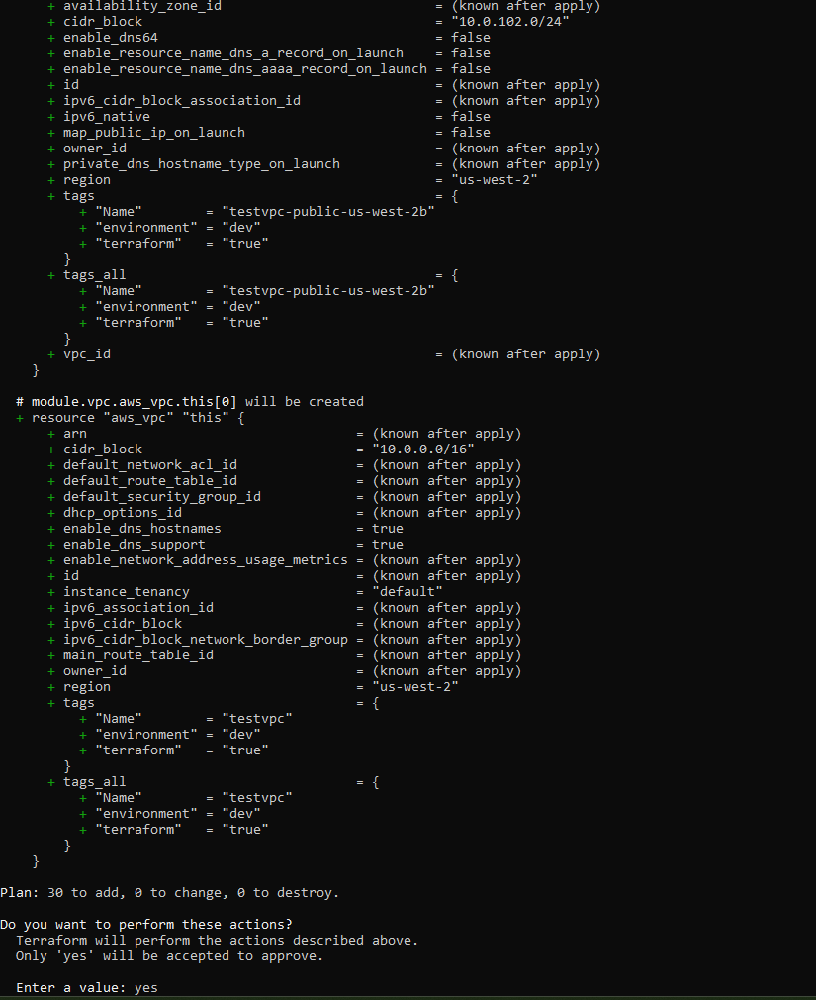
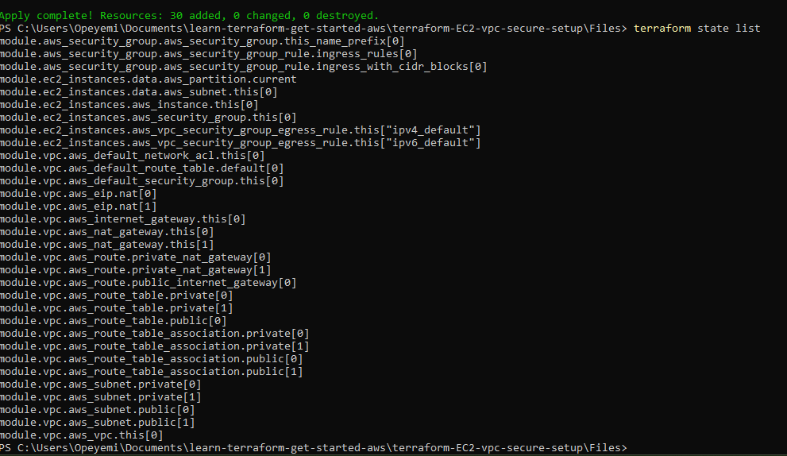

# Terraform EC2 + VPC Secure Setup (Advanced)

This project builds on my previous work [terraform-ec2-with-module-variable-output](https://github.com/Opeyemi-00/terraform-ec2-with-module-variable-output). The goal here is to go a bit deeper — using Terraform modules to set up a secure AWS environment with EC2 instances, a custom VPC, and security groups.

## 🚀 Project Overview

This Terraform configuration:

- Creates a custom VPC with public and private subnets across multiple AZs  
- Enables DNS hostnames, NAT Gateway, and optional VPN support  
- Launches multiple EC2 instances into private subnets  
- Uses a custom security group that allows HTTPS and custom TCP ports  
- Uses variables for flexibility and reusability



🔧 Prerequisites

- [`Terraform CLI`](https://developer.hashicorp.com/terraform/downloads)
- AWS IAM user with appropriate permissions
- AWS credentials configured via `aws configure`

🛠️ How to Use

1. Clone the Repository

```
git clone https://github.com/Opeyemi-00/terraform-ec2-vpc-secure-setup.git
cd terraform-ec2-vpc-secure-setup
```

2. Review/Edit Variables

Modify values in `variables.tf` as needed (e.g. region, AMI, subnets, instance count).

3. Initialize and Deploy

```
terraform init
terraform plan
terraform apply
```



🧩 Modules Used

- [`terraform-aws-modules/vpc/aws`](https://registry.terraform.io/modules/terraform-aws-modules/vpc/aws)
- [`terraform-aws-modules/ec2-instance/aws`](https://registry.terraform.io/modules/terraform-aws-modules/ec2-instance/aws)
- [`terraform-aws-modules/security-group/aws`](https://registry.terraform.io/modules/terraform-aws-modules/security-group/aws)

🧠 What I Learned

- How to replace resource blocks with modules for scalability
- How to define flexible and reusable infrastructure using variables
- How to improve the security setup of my VPC and EC2 deployment
- How to oganize Terraform projects more cleanly


