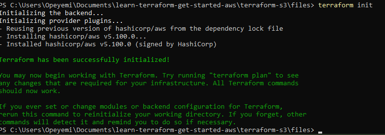

# AWS S3 Terraform Setup

## ✨ Overview

This project shows how to use Terraform to provision an Amazon S3 bucket with some key configurations. The goal is to manage the infrastructure as code instead of setting things up manually via the AWS Console.

## ✅ What This Project Does

- Creates an S3 bucket with a unique name
- Applies a **private access policy** using ACL
- Enables **versioning** on the bucket to track object changes
- Keeps the Terraform configuration clean and reusable


⚙️ **How To Use**

1. Clone the Repository

```
git clone https://github.com/Opeyemi-00/learn-terraform-get-started-aws.git
cd terraform-s3/Files
```
2. Configure AWS CLI: 

Before running Terraform, make sure your AWS credentials are configured:

```
aws configure
```
Provide your:

- Access Key
- Secret Key
- Default Region (e.g. eu-west-2)
- Output format (json)

3. Initialize Terraform

```
terraform init
```


4. Deploy Resources

```
terraform plan
terraform apply
```


This will create theS3 bucket with versioning and a private ACl

🧠 What I Practiced / Learned

- Writing Terraform code for AWS S3
- Managing resource configurations like ACLs and versioning
- Using terraform init and terraform apply effectively
- Pushing changes to GitHub after provisioning

🔒 Notes

- Each AWS S3 bucket must have a globally unique name.
- You can customize the region and bucket name by editing the variables directly.


